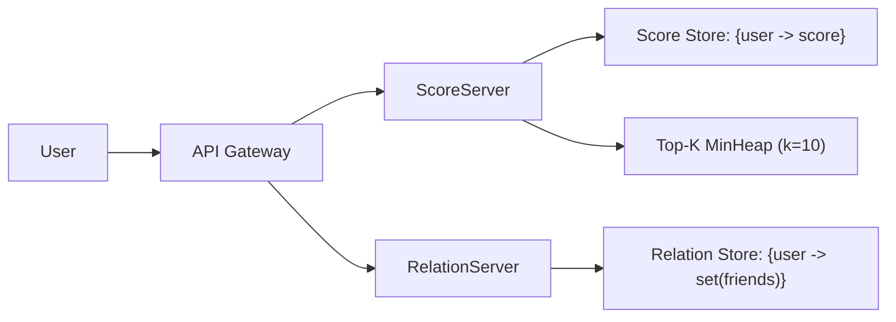

# GameTracker Toy Framework

A compact system design toy implementation for game scoring.

Users play games and get:
- `+1` score for a win
- `+0` score for a loss

The framework exposes two leaderboard views:
- Global top 10 players
- Top 10 friends of a given user

## Architecture



## Core APIs

| API | Purpose |
| --- | --- |
| `update_score(user, won=True)` | Update a user's score (`+1` on win, `+0` on loss) |
| `add_friend(user1, user2)` | Add a bidirectional friend relation |
| `delete_friend(user1, user2)` | Remove a bidirectional friend relation |
| `get_top_score()` | Return global top players (up to 10) |
| `get_top_score_friend_of(user)` | Return top scoring friends (up to 10) |

## Project Layout

```text
game_tracker/
  __init__.py
  framework.py      # APIGateway, ScoreServer, RelationServer
tests/
  test_framework.py # pytest tests
requirements.txt
pyproject.toml
```

## Quick Start (Conda)

```bash
conda activate <your-env>
python -m pip install -r requirements.txt
python -m pytest -q
```

## Usage Example

```python
from game_tracker import APIGateway, RelationServer, ScoreServer

gateway = APIGateway(
    score_server=ScoreServer(top_k=10),
    relation_server=RelationServer(),
    authorized_users={"alice", "bob", "carol"},
)

gateway.add_friend("alice", "bob")
gateway.add_friend("alice", "carol")

gateway.update_score("bob", won=True)
gateway.update_score("bob", won=True)
gateway.update_score("carol", won=True)

print(gateway.get_top_score())
print(gateway.get_top_score_friend_of("alice"))
```

## Why This Works for a Toy Design

- `ScoreServer` keeps full scores in memory and tracks global top-k with a min-heap style structure.
- `RelationServer` keeps friendship edges in memory as adjacency sets.
- `APIGateway` centralizes simple auth checks and delegates to domain services.

This is intentionally lightweight and optimized for clear explanation, not production deployment.

## Test Coverage

Current tests validate:
- Win/loss scoring behavior
- Global top-10 filtering and ordering
- Friend leaderboard + friend removal
- Auth rejection for unauthorized users

Run:

```bash
python -m pip install -r requirements.txt
python -m pytest -q
```
